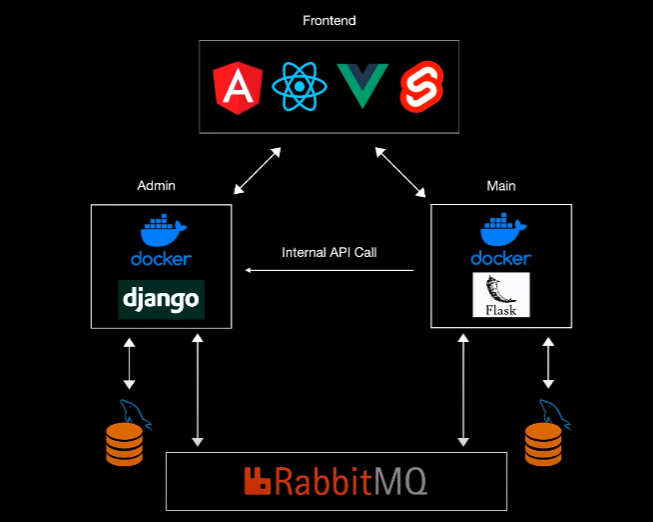

# python-microservices

Source: <https://www.youtube.com/watch?v=0iB5IPoTDts>



## set up

```bash
    # Install
    pip install djangorestframework
    pip install markdown       # Markdown support for the browsable API.
    pip install django-filter  # Filtering support

    django-admin startproject admin

    # Run
    cd admin
    python3 manage.py runserver
```

## Adding dockerFiles

```bash
    # Docker
    docker-compose up
```

## Connect Django with MySQL with Docker

```bash
python manage.py startapp products
```

## Models & Serializers

- python manage.py makemigrations
- python manage.py migrate

##

...

## Flask Setup with Docker

mkdir main folder and config.

### Flask app doesn't work

Requirements.txt file should look:

```txt
Flask>=2.2.2
Flask-SQLAlchemy==2.4.4
SQLAlchemy==1.3.20
Flask-Migrate==2.5.3
Flask-Script==2.0.6
Flask-Cors==3.0.9
requests==2.25.0
mysqlclient==2.0.1
pika==1.1.0
```

After modifying the requirements.txt file, rebuild your Docker image to ensure the changes take effect. You can do this by running `docker-compose build`.

Finally, run your Docker containers again with `docker-compose up`.

Postman test: <http://localhost:8001>

```txt
Hello world!
```

## Connect Flask with Mysql

...

## Models

...

## Flask Migrations

docker-compose exec backend sh

> export FLASK_APP=main

> flask db init

> flask db migrate -m 'Migration message'

> flask db upgrade
